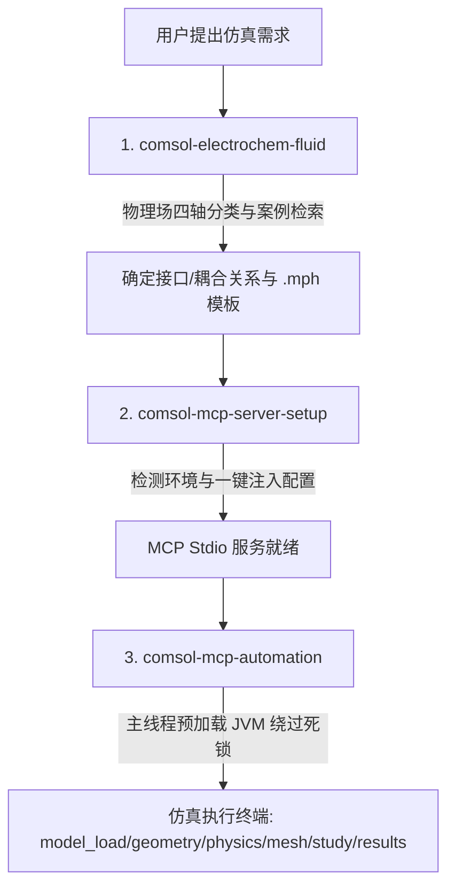

# AI Agent 驱动的 COMSOL Multiphysics 自动化搭建与使用指南

本仓库开源了一套专为 **AI Agent（如 Antigravity, Claude Code 等）** 设计的 COMSOL 物理仿真控制与方案设计工具链（Skills & MCP Server）。这套工具链打通了从**多物理场概念设计、环境一键部署、到仿真模型自动构建与求解**的全生命周期。

特别针对**电化学-流体传热传质耦合**仿真提供了完整的方法论与检索案例，适合用于开发自主进行科学物理计算与优化设计的智能体。

---

## 📂 工具链架构概览

本仓库包含三个核心模块（以 AI Agent Skills 的形式组织），它们相辅相成：



### 1. [comsol-electrochem-fluid](./comsol-electrochem-fluid) (物理场映射与案例库)
- **定位**：传热传质与电化学仿真方案的**决策大脑**。
- **作用**：规范电化学及流体流态分类（四轴分类法），提供官方 Application Library 范例的智能检索，指导物理场退化和维度递进策略。

### 2. [comsol-mcp-server-setup](./comsol-mcp-server-setup) (服务一键部署与注册)
- **定位**：AI 助手与本机的**桥梁架设器**。
- **作用**：自动浅克隆、安装 Python 依赖库（`mph`, `chromadb`, `torch` 等）、向 AI 配置文件注入运行环境变量（如 COMSOL 绑定的 JRE 和 HuggingFace 镜像站），生成标准 stdio MCP 接口。

### 3. [comsol-mcp-automation](./comsol-mcp-automation) (COMSOL MCP 自动化执行终端)
- **定位**：仿真动作的**具体执行终端**。
- **作用**：基于 wjc9011 的 COMSOL MCP Server 提供 80+ 级操作接口，或通过 MPh 直接修改参数、构建几何、控制选择集、求解并提取图形和数据。

---

## ⚡ 关键避坑指南：JVM 启动死锁（JPype + FastMCP/AnyIO）

在基于 stdio 管道 and 异步框架（如 FastMCP、anyio、asyncio）构建 AI Agent 控制的 COMSOL 服务时，存在一个底层冲突：

> [!WARNING]
> **JPype JVM 启动死锁**
> FastMCP 会自动将同步定义的工具（如 `@mcp.tool() def comsol_start`）分配到 `ThreadPoolExecutor`（子线程池）中异步执行。
> 在 Windows 环境下，通过子线程调用 `jpype.startJVM()` 或初始化 `mph.Client()` 会与主线程的事件循环以及管道数据重定向（stdio Capture）发生锁冲突，导致 **JVM 进程永久卡死** 在 `Starting Java virtual machine` 阶段。

### 🛠️ 解决方案（已集成在本项目中）
不要在工具回调函数（子线程）中延迟加载 JVM。在服务的主入口 `main()` 函数启动后、`mcp.run()` 运行之前，强制在**主线程**内预启动 COMSOL 会话：

```python
# 位于 src/server.py
def main() -> None:
    logger.info("Starting COMSOL MCP Server...")
    
    register_all_tools()
    register_all_resources()
    
    # 核心修复：在主线程启动阶段预加载 JVM，绕过 AnyIO 子线程池死锁
    logger.info("Pre-starting COMSOL session on main thread...")
    try:
        from .tools.session import session_manager
        res = session_manager.start() # 内部执行 mph.Client() 初始化 JVM
        if res.get("success"):
            logger.info(f"COMSOL session pre-started successfully: {res}")
        else:
            logger.error(f"Failed to pre-start: {res.get('error')}")
    except Exception as e:
        logger.error(f"Failed to pre-start: {e}")
        
    mcp.run() # 启动 FastMCP 服务
```
后续的工具调用只需检测 `session_manager.client` 是否就绪，若已就绪直接执行 `.clear()` 即可瞬间返回响应，消除了任何卡死隐患。

---

## 🧪 电化学-流体耦合（EC-CFD）建模指南

在设计涉及电极反应、电解质传质、多相气泡演化及对流换热的耦合系统时，AI Agent 应遵循以下体系化的设计范式：

### 1. 四轴分类框架 (Four-Axis Classification)

| 轴向 | 分类档次（由低到高） | 选择依据与边界 |
| :--- | :--- | :--- |
| **电化学保真度** | 1. 一次电流分布 (Primary)<br>2. 二次电流分布 (Secondary)<br>3. 三次电流分布 (Tertiary / Nernst-Planck)<br>4. 多孔电极 / 电池接口 | - 若电解质浓度差很小，使用一次/二次电流分布（仅求解 Ohm 定律）。<br>- 若传质阻抗不可忽略（如高电流密度下极限扩散电流），必须使用三次电流分布。<br>- 锂电池、燃料电池催化层等复杂夹层介质使用专用多孔电极接口。 |
| **流体流态** | 1. 无流动<br>2. 层流 (Laminar)<br>3. 湍流 (Turbulent)<br>4. 微流控 (Microfluidics)<br>5. 多孔介质流动 (Darcy/Brinkman)<br>6. 多相流 (Multiphase) | - 若 Peclet 数很小，对流可忽略。<br>- 气化产物（如析氢/析氧）会改变电导率，须引入多相气泡流。<br>- 多孔电极内部的气气/气液流动使用 Darcy/Brinkman 方程。 |
| **耦合场** | 1. EC + 传质 (浓度场对流)<br>2. EC + 传质 + 流体 (析气电导率变化)<br>3. EC + 流体 + 传热 (非等温系统) | - 浓度场对流：流体流速 \(u\) 作为对流项引入稀物质传递。<br>- 电导率变化：气泡体积分数 \(\phi_g\) 降低有效电导率 \(\sigma_{\text{eff}} = \sigma_0 (1-\phi_g)^{1.5}\)。 |
| **空间维度** | 1. 1D 动力学<br>2. 2D / 2D Axisymmetric 传质<br>3. 3D 流道设计 | - 1D 用于 Tafel 斜率、活化能等动力学参数的标定与拟合。<br>- 2D 轴对称用于旋转圆盘电极（RDE）、单电极局部流动模拟。<br>- 3D 仅用于非对称的复杂流道（如蛇形流道）或非均匀多部件组装体。 |

### 2. 耦合变量与公式设计模式

在自动生成或修改模型时，Agent 需要正确绑定以下耦合项：

```
                              [流体场 (Laminar Flow)]
                                       │
                                       │ (流动速度 u)
                                       ▼
    [电化学场 (Tertiary EC)] ──(反应源项 R)──> [稀物质传递 (tds)]
           ▲                                   │
           │                                   │ (电解质电导率 / 浓度 C)
           └───────────────────────────────────┘
```

- **流动对电化学传质的耦合**：流体流速 \(\mathbf{u}\) 必须输入到稀物质传递（`tds`）或三次电流分布接口的对流项中。
- **电化学反应对传质的源项耦合**：反应产生的物质摩尔源项 \(R_i\) 与局部电流密度 \(i_{loc}\) 和法拉第常数 \(F\) 强相关：
  \[
  R_i = -\frac{\nu_i \cdot i_{loc}}{n \cdot F}
  \]
- **两相流中的电导率修正 (Maxwell 关系)**：若电极析气产生气泡，有效电解液电导率 \(\kappa_{\text{eff}}\) 必须根据局部气含率 \(\phi_g\) 进行修正：
  \[
  \kappa_{\text{eff}} = \kappa_0 \cdot (1 - \phi_g)^{1.5}
  \]

### 3. 典型耦合 Starter 模板

在 Application Library 中，优先引导 Agent 加载以下经典范例作为基础 seed 文件进行修改，切勿从头手绘几何与物理场：

1. **电沉积与析气流强耦合**：`Electrodeposition_Module\Tutorials\cu_electrowinning_bubbly_flow.mph`
   - *特点*：三次电流分布 + 稀物质传递 + 气泡流（Bubbly Flow）。非常适合用于设计带气液分离的电化学反应器。
2. **非等温燃料电池强耦合**：`Fuel_Cell_and_Electrolyzer_Module\Fuel_Cells\nonisothermal_pem_fuel_cell.mph`
   - *特点*：电化学反应 + 多孔介质传质 + 气体流道流动 + 固体/液体传热。是理解非等温多相流 EC 系统的终极模板。
3. **电渗流微阀控制**：`Microfluidics_Module\Fluid_Flow\electrokinetic_valve.mph`
   - *特点*：静电场（库伦力） + 层流流动（电渗体力的源项引入）。适用于微流控芯片设计。

---

## 🚀 AI Agent 自动调用工作流示例

在典型的对话中，AI Agent 在阅读并激活该工具链后，可以通过以下标准工具链调用执行一个“加载并修改电化学仿真参数”的任务：

### Step 1: 获取 COMSOL 会话状态
```json
// Call Tool: comsol_status
{}
// Response:
// { "connected": true, "version": "6.3", "standalone": true }
```

### Step 2: 加载真空干燥模型
```json
// Call Tool: model_load
{ "file_path": "C:\\COMSOL_Models\\vacuum_drying.mph" }
// Response:
// { "success": true, "model": { "name": "vacuum_drying", ... } }
```

### Step 3: 修改蒸发速率常数和加热温度
```json
// Call Tool: param_set
{
  "name": "kvap",
  "expression": "5e-6[1/s]"
}
// Call Tool: param_set
{
  "name": "Th",
  "expression": "75[degC]"
}
```

### Step 4: 重建几何与求解
```json
// Call Tool: geometry_build
{}
// Call Tool: study_solve
{
  "study_name": "Study 1"
}
```

### Step 5: 评估与导出计算图表
```json
// Call Tool: results_evaluate
{
  "expression": "ht.Tmax",
  "unit": "degC"
}
// Call Tool: results_export_image
{
  "plot_group": "Temperature (ht)",
  "file_path": "C:\\COMSOL_Models\\T_max_distribution.png"
}
```

---

## 🛟 开源与 GitHub 集成建议

如果您计划将本指南及配套 Skill 开源到 GitHub，建议采取以下仓库目录布局：

```text
comsol-agent-automation/
├── README.md                          <-- 本指南文件
├── comsol-electrochem-fluid/          <-- 物理场决策与检索 Skill 目录
│   ├── SKILL.md
│   ├── scripts/
│   └── references/
├── comsol-mcp-server-setup/           <-- 环境搭建与注册 Skill 目录
│   ├── SKILL.md
│   └── references/
└── comsol-mcp-automation/             <-- MCP 执行引擎 Skill 目录
    ├── SKILL.md
    └── references/
```

该指南能够帮助全球使用 AI Agent 的开发者以及寻求 COMSOL 自动化科研的工程师，快速规避 Java 虚拟机初始化崩溃的深水区陷阱，大幅提升电化学反应器的参数化自动设计效率。
